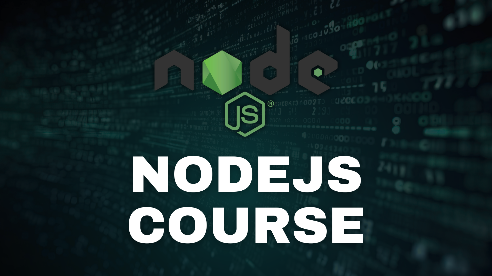

# NODEJS-COURSE



## INTRODUCTION

Node.js fundamentals course.

## TECHNOLOGIES

- Node.js

## INSTALLATION

1. Install the recommended version for most users of **Node.js** from the following link.

https://nodejs.org/en

2. Use the **npm** package manager to install.
3. Execute the command from the terminal located at ./NODEJS-COURSE.

```shell
npm i
```

## EXECUTION

4. For single files execute the command from the terminal located in ./NODEJS-COURSE.

```shell
node "name_file".js
```

5. For the `./first_node_project` and `./node_website` folders use the **npm** package manager to install.
6. Execute the command from the terminal located at ./NODEJS-COURSE/`name_folder`.

```shell
npm i
```

7. Use the **npm** package manager to run.
8. Execute the command from the terminal located at ./NODEJS-COURSE/`name_folder`.

```shell
npm run dev
```

9. For the `./public` folder use the **npx** package executor to run.
10. Execute the command from the terminal located at ./NODEJS-COURSE.

```shell
npx serve public
```
